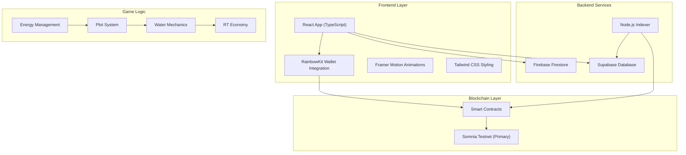
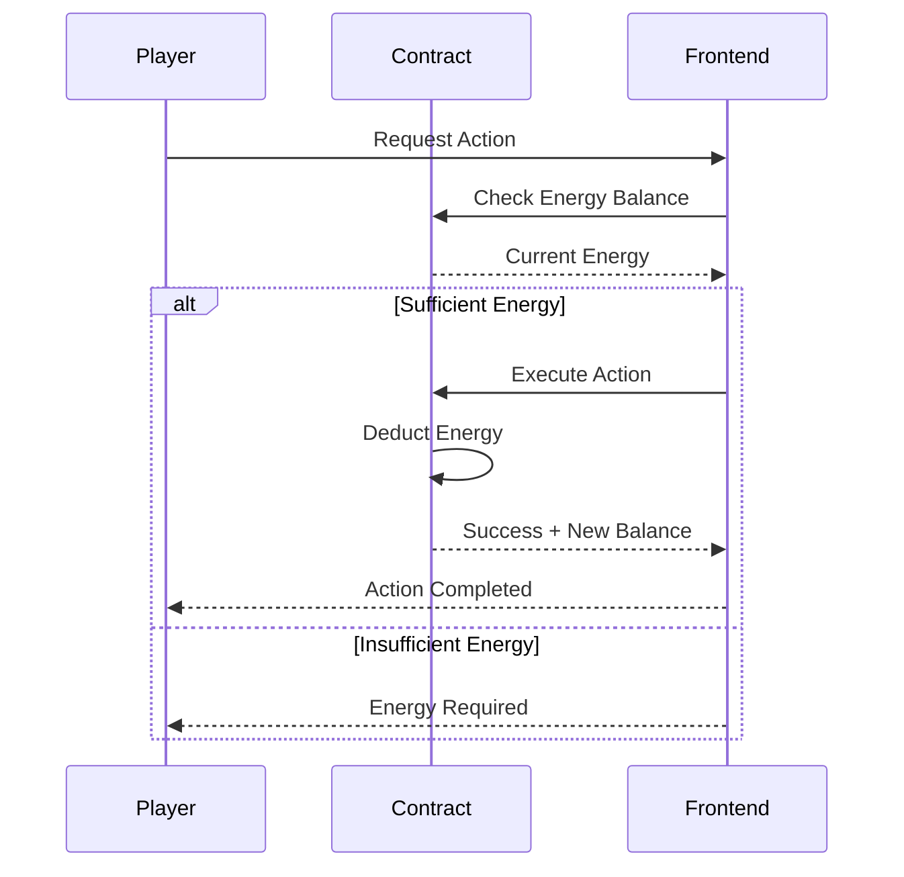
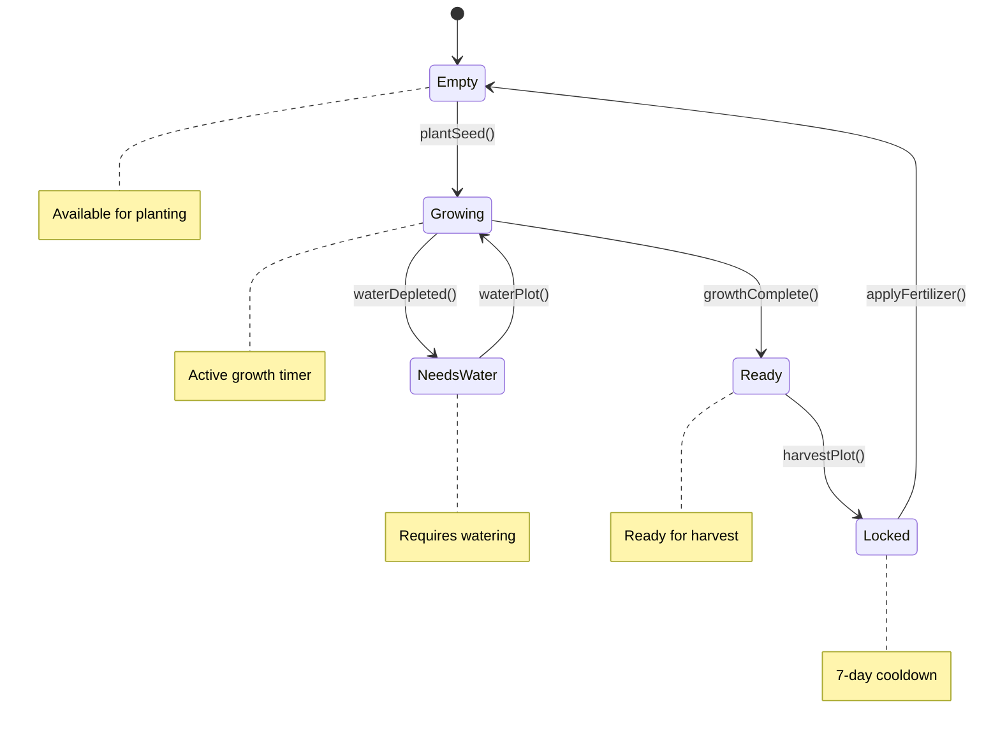
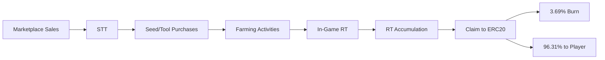

# 🏗️ RiceRise Architecture Documentation

## System Overview

RiceRise is a blockchain farming game built with a modular architecture that separates concerns between smart contracts, frontend, and backend services. The system emphasizes strategic gameplay through resource management and sustainable economic mechanics.

## 🏛️ High-Level Architecture



## 🔗 Smart Contract Architecture

### Core Contract: SomniaFarming.sol

```solidity
// Core contract structure
contract SomniaFarming is Ownable, Pausable, ReentrancyGuard {
    // Plot management
    struct Plot {
        uint8 state;        // 0=Empty, 1=NeedsWater, 2=Growing, 3=Ready, 4=Locked
        uint256 plantedAt;
        uint256 lastWatered;
        uint256 waterLevel;
        uint8 seedId;
        uint256 expectedYield;
        uint256 harvestedAt;
    }
    
    // Energy system
    mapping(address => uint256) public energy;
    mapping(address => uint256) public lastEnergyRecharge;
    
    // Token economy
    mapping(address => uint256) public riceTokens;
    mapping(address => uint256) public totalXP;
    
    // Plot system
    mapping(address => Plot[25]) public plots;
}
```

### Key Functions

```solidity
// Core farming functions
function plantSeed(uint8 plotId, uint8 seedId) external
function waterPlot(uint8 plotId) external
function harvestPlot(uint8 plotId) external
function claimRT() external
function rechargeEnergy() external

// Admin functions
function pause() external onlyOwner
function unpause() external onlyOwner
function emergencyWithdraw() external onlyOwner
```

## 🎮 Game Mechanics Architecture

### Energy System Flow



### Plot State Machine



## 🌊 Water Management System

### Water Depletion Algorithm

```typescript
// Water decreases by 0.0278% every 2 minutes
const WATER_DEPLETION_RATE = 0.000278; // 0.0278%
const DEPLETION_INTERVAL = 2 * 60 * 1000; // 2 minutes in ms

function calculateWaterLevel(lastWatered: number, currentTime: number): number {
    const timeDiff = currentTime - lastWatered;
    const intervals = Math.floor(timeDiff / DEPLETION_INTERVAL);
    const depletion = intervals * WATER_DEPLETION_RATE;
    
    return Math.max(0, 100 - depletion);
}
```

### Critical Water Thresholds

- **100%**: Optimal growth conditions
- **75%**: Growth continues normally
- **50%**: Growth rate reduced
- **25%**: Growth significantly slowed
- **0%**: Growth stops, plot enters "Needs Water" state

## 💰 Economic Architecture

### Dual-Token Flow



### Token Economics

- **In-Game RT**: Earned through farming, used for tools and upgrades
- **ERC20 RICE**: Claimable from in-game RT with burn mechanism
- **Burn Rate**: 3.69% on conversion (sustainable deflation)
- **Vesting**: Gradual release prevents market flooding

## 🏗️ Frontend Architecture

### Component Hierarchy

```
App.tsx
├── StrategicWarningCard (Mandatory Welcome)
├── ToastContainer (Strategic Reminders)
├── HomeScreen
│   ├── FarmGrid (25 Plot Grid)
│   ├── DailyRewardModal
│   └── Quest System
├── Marketplace
│   ├── Item Cards
│   ├── P2P Trading
│   └── Price Management
├── Profile
│   ├── RT Balance
│   ├── Claim Interface
│   └── User Stats
└── Navigation
    ├── Farm
    ├── Global Farm
    ├── Marketplace
    ├── Trade
    ├── Inventory
    ├── Leaderboard
    └── Profile
```

### State Management

```typescript
// Core game state
interface GameState {
    energy: number;
    plots: Plot[];
    riceTokens: number;
    dailyStreak: number;
    totalXP: number;
    playerLevel: number;
}

// Plot state management
interface PlotState {
    id: number;
    status: 'empty' | 'growing' | 'ready' | 'watering' | 'withering' | 'needsWater';
    cropType: string;
    progress: number;
    waterLevel: number;
    quality: 'poor' | 'good' | 'excellent' | 'perfect';
    expectedYield: number;
}
```

## 🔧 Backend Architecture

### Firebase Integration

```typescript
// User data structure
interface UserData {
    address: string;
    energy: number;
    plots: Plot[];
    riceTokens: number;
    dailyStreak: number;
    totalXP: number;
    lastEnergyRecharge: number;
    recentActivity: Activity[];
}

// Real-time updates
function onUserDataSnapshot(address: string, callback: (data: UserData) => void) {
    return onSnapshot(doc(db, 'users', address), callback);
}
```

### Supabase Indexer

```typescript
// Marketplace event tracking
interface MarketplaceEvent {
    id: string;
    chainId: number;
    contractAddress: string;
    eventType: 'ListingCreated' | 'ListingSold' | 'ListingCancelled';
    listingId: number;
    seller: string;
    buyer?: string;
    price: string;
    timestamp: number;
}

// Single-chain indexing
class SomniaFarmingIndexer {
    private config: ChainConfig;
    
    async start() {
        const indexer = new ChainFarmingIndexer(this.config);
        await indexer.start();
    }
}
```

## 🚀 Deployment Architecture

### Single-Chain Deployment

```typescript
// Chain configuration
const CHAIN_CONFIG = {
    somnia: {
        name: 'Somnia Testnet',
        chainId: 50312,
        contractAddress: '0x65268AEbBA4ebfdFE1FcaE8f99D3A6181Ce49eFC',
        wsUrl: 'wss://dream-rpc.somnia.network/ws',
        httpUrl: 'https://dream-rpc.somnia.network',
        nativeToken: 'STT',
        explorer: 'https://shannon-explorer.somnia.network/'
    }
};
```

### Environment Management

```bash
# Main environment file
VITE_CURRENT_CHAIN=SOMNIA
VITE_FARMING_ADDRESS=0x65268AEbBA4ebfdFE1FcaE8f99D3A6181Ce49eFC
VITE_CHAIN_ID=50312
VITE_RPC_URL=https://dream-rpc.somnia.network
VITE_CURRENCY_SYMBOL=STT

# Single chain address
VITE_SOMNIA_FARMING_ADDRESS=0x65268AEbBA4ebfdFE1FcaE8f99D3A6181Ce49eFC
```

## 🔒 Security Architecture

### Smart Contract Security

- **Ownable**: Admin controls for emergency functions
- **Pausable**: Ability to pause during security incidents
- **ReentrancyGuard**: Protection against reentrancy attacks
- **Input Validation**: Comprehensive parameter checking
- **Access Control**: Role-based function access

### Frontend Security

- **Wallet Integration**: Secure connection through RainbowKit
- **Transaction Signing**: User approval for all blockchain actions
- **Data Validation**: Client-side input sanitization
- **Error Handling**: Graceful failure modes

## 📊 Performance Optimization

### Contract Optimization

- **Gas Efficiency**: Optimized function calls and storage
- **Batch Operations**: Grouped transactions where possible
- **Event Optimization**: Minimal event data for gas savings
- **Storage Packing**: Efficient struct layout

### Frontend Optimization

- **React Optimization**: Memoization and lazy loading
- **Bundle Splitting**: Code splitting for better load times
- **Image Optimization**: Compressed assets and lazy loading
- **Caching Strategy**: Local storage and session management

## 🔮 Future Architecture

### Planned Improvements

- **Layer 2 Integration**: Scaling solutions for mainnet
- **Mobile App**: Native mobile experience
- **AI Integration**: Smart farming recommendations
- **DAO Governance**: Community-driven development

### Scalability Considerations

- **Microservices**: Modular backend architecture
- **CDN Integration**: Global content delivery
- **Database Optimization**: Efficient data storage

---

*This architecture documentation provides a comprehensive overview of RiceRise's technical implementation and system design.*
