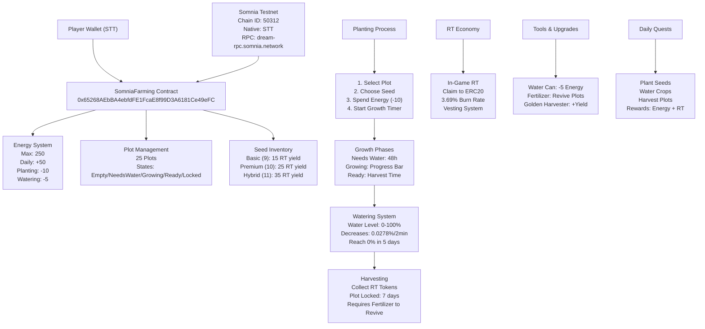

# 🌾 RiceRise - Blockchain Farming Game

A strategic blockchain farming game built on Somnia testnet with dual-token economy, energy management, and sustainable gameplay mechanics.

## 🎯 Game Overview

RiceRise is a strategy-focused farming game where players must carefully manage their energy, water resources, and RT (Rice Tokens) to maintain continuous farming operations. The game emphasizes strategic resource management - running out of energy or RT means losing access to core gameplay features.

## 🏗️ Architecture

## 🎮 Core Game Mechanics

### Energy System
- **Maximum Energy**: 250
- **Daily Recharge**: +50 energy
- **Planting Cost**: -10 energy
- **Watering Cost**: -5 energy
- **Strategic Importance**: Running out of energy blocks all farming activities

### Plot Management
- **Total Plots**: 25 per player
- **Plot States**:
  - `Empty`: Available for planting
  - `Needs Water`: Requires watering to continue growth
  - `Growing`: Active growth with progress bar
  - `Ready`: Ready for harvest
  - `Locked`: 7-day cooldown after harvest

### Water Management
- **Water Level**: 0-100%
- **Depletion Rate**: 0.0278% every 2 minutes
- **Time to Zero**: 5 days from full
- **Critical**: Plots stop growing when water reaches 0%

### Growth System
- **Basic Seeds**: 15 RT yield, 48h growth time
- **Premium Seeds**: 25 RT yield, 48h growth time  
- **Hybrid Seeds**: 35 RT yield, 48h growth time
- **Bundle Bonus**: 40% yield increase for seed bundles

## 🌱 Farming Process

1. **Planting**
   - Select an empty plot
   - Choose seed type (Basic/Premium/Hybrid)
   - Spend 10 energy
   - Start growth timer

2. **Growth Phase**
   - Monitor water levels
   - Water crops when needed (-5 energy)
   - Track progress bar
   - Maintain optimal conditions

3. **Harvesting**
   - Collect RT tokens when ready
   - Plot enters 7-day lock period
   - Requires Fertilizer to revive

4. **Plot Revival**
   - Apply Fertilizer after cooldown
   - Plot returns to empty state
   - Ready for new planting cycle

## 💰 Token Economy

### Dual-Token System
- **In-Game RT**: Earned through farming activities
- **ERC20 RICE**: Claimable from in-game RT
- **Burn Mechanism**: 3.69% burn rate on conversion
- **Vesting**: Gradual release of claimed tokens

### Economic Balance
- **Sustainable Farming**: Continuous RT generation
- **Resource Scarcity**: Limited energy and water
- **Strategic Decisions**: Balance planting vs. harvesting
- **Market Dynamics**: P2P trading and marketplace

## 🛠️ Tools & Equipment

### Essential Tools
- **Water Can**: Water crops (-5 energy)
- **Fertilizer**: Revive locked plots
- **Golden Harvester**: Increase yield bonuses

### Seed Types
- **Basic Bundle**: 5 seeds, 40% bonus
- **Premium Bundle**: 5 seeds, 40% bonus
- **Hybrid Bundle**: 5 seeds, 40% bonus

## 🎯 Daily Quests & Rewards

### Quest Types
- Plant specific number of seeds
- Water crops multiple times
- Harvest completed plots
- Maintain daily streaks

### Rewards
- **Energy Recharge**: +50 daily energy
- **RT Tokens**: Bonus farming rewards
- **Experience Points**: Level progression
- **Streak Bonuses**: Multiplier rewards

## 🔗 Network Deployment

### Somnia Testnet (Primary)
- **Contract**: `0x65268AEbBA4ebfdFE1FcaE8f99D3A6181Ce49eFC`
- **Chain ID**: 50312
- **Native Token**: STT
- **RPC**: `https://dream-rpc.somnia.network`
- **Explorer**: `https://shannon-explorer.somnia.network`

## 🚀 Getting Started

### Prerequisites
- MetaMask or compatible wallet
- STT tokens for gas fees (Somnia)
- Understanding of strategic resource management

### First Steps
1. Connect wallet to Somnia Testnet
2. Read the Strategic Warning thoroughly
3. Start with Basic Seeds to learn mechanics
4. Always maintain energy and RT reserves
5. Complete daily quests for bonuses

## ⚠️ Strategic Warnings

### Critical Game Rules
- **Energy Management**: Never let energy reach 0
- **RT Reserves**: Always keep minimum 500 RT
- **Water Monitoring**: Check plots every 2-3 days
- **Plot Rotation**: Don't harvest all plots simultaneously
- **Resource Planning**: Balance short-term gains with long-term sustainability

### Common Mistakes
- Planting without energy reserves
- Ignoring water levels until too late
- Harvesting all plots at once
- Not completing daily quests
- Spending RT without farming backup

## 🏆 Success Strategies

### Beginner Level
- Start with 2-3 plots
- Focus on Basic Seeds
- Complete daily quests
- Build RT reserves gradually

### Intermediate Level
- Expand to 10-15 plots
- Mix seed types strategically
- Use tools efficiently
- Maintain water rotation

### Advanced Level
- Optimize all 25 plots
- Maximize bundle bonuses
- Strategic marketplace trading
- Energy optimization techniques

## 🔧 Technical Details

### Smart Contract Features
- **Ownable**: Admin controls
- **Pausable**: Emergency pause functionality
- **ReentrancyGuard**: Security protection
- **Plot Management**: 25 plot system
- **Energy System**: Daily recharge mechanism

### Frontend Technologies
- **React 18**: Modern UI framework
- **TypeScript**: Type-safe development
- **Wagmi**: Ethereum hooks
- **Framer Motion**: Smooth animations
- **Tailwind CSS**: Utility-first styling

### Backend Services
- **Firebase**: User data and authentication
- **Supabase**: Marketplace indexing
- **Node.js**: Event indexing service

## 📊 Performance Metrics

### Game Statistics
- **Active Players**: Growing community
- **Total Plots**: 25 per player
- **Daily Transactions**: Farming activities
- **RT Circulation**: Sustainable economy

### Network Performance
- **Block Time**: Fast confirmations
- **Gas Costs**: Optimized for gaming
- **Scalability**: Single-chain architecture

## 🤝 Contributing

### Development Areas
- **Smart Contracts**: Solidity optimization
- **Frontend**: React component improvements
- **Backend**: Indexing and data services
- **Documentation**: Game guides and tutorials

### Getting Involved
1. Fork the repository
2. Create feature branch
3. Implement improvements
4. Submit pull request
5. Join community discussions

## 📄 License

This project is licensed under the MIT License - see the [LICENSE](LICENSE) file for details.

## 🆘 Support

### Resources
- **Documentation**: Comprehensive game guides
- **Community**: Active player discussions
- **Discord**: Real-time support channel
- **GitHub Issues**: Bug reports and feature requests

### Contact
- **Developer**: Solo developer team
- **Email**: Available through GitHub
- **Discord**: Community server link

---

**⚠️ Remember**: RiceRise is a strategy game. Always maintain energy and RT reserves to avoid being locked out of farming activities!

*Built with ❤️ for the blockchain gaming community*
